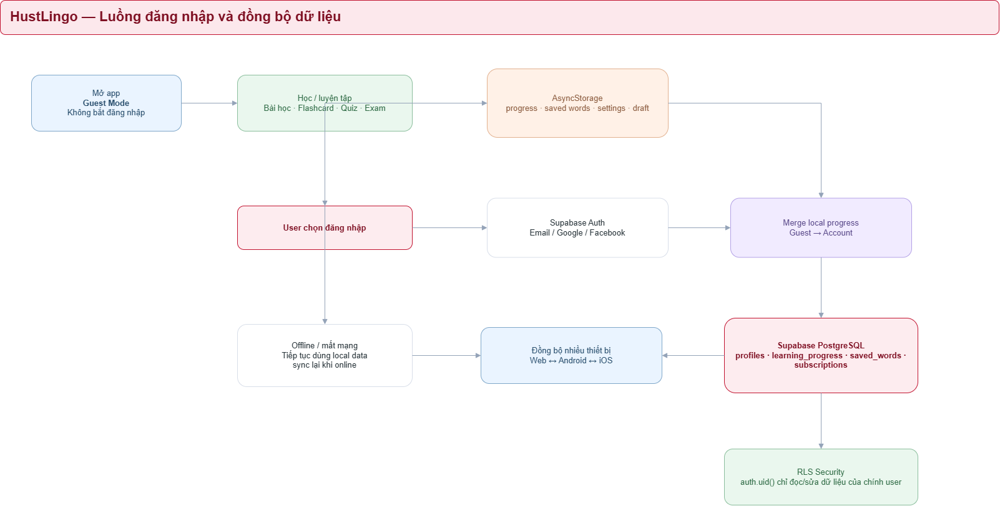
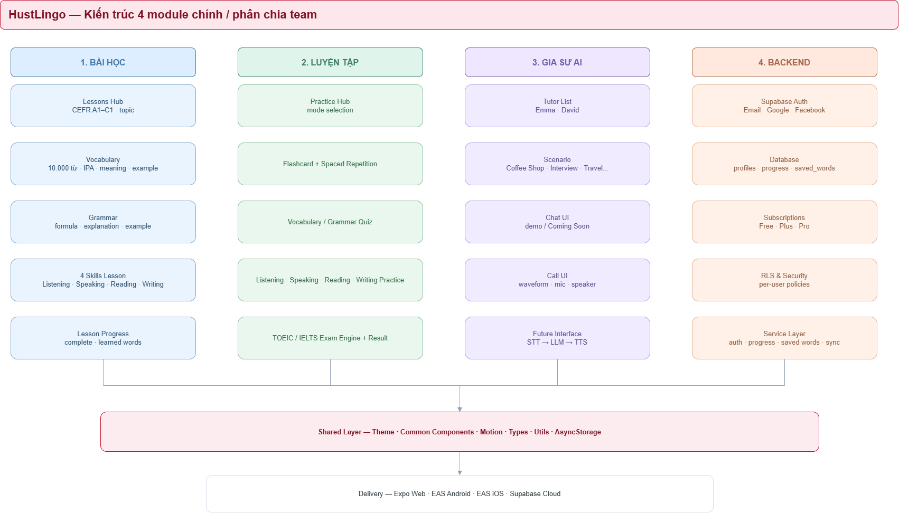

# HustLingo

HustLingo là ứng dụng học tiếng Anh đa nền tảng dành cho **Web, Android và iOS**, được xây dựng bằng **Expo + React Native + TypeScript**, dùng **Expo Router** cho navigation và **Supabase** cho Auth, PostgreSQL, đồng bộ dữ liệu và các chức năng backend.

Project được tổ chức theo hướng **feature-based architecture** để nhóm 4 người có thể phát triển song song, giảm conflict Git và giới hạn phạm vi code của từng thành viên.

---

## Mục lục

1. [Mục tiêu project](#1-mục-tiêu-project)
2. [Kiến trúc tổng quan](#2-kiến-trúc-tổng-quan)
3. [Luồng đăng nhập và đồng bộ dữ liệu](#3-luồng-đăng-nhập-và-đồng-bộ-dữ-liệu)
4. [Phân chia 4 module chính](#4-phân-chia-4-module-chính)
5. [Công nghệ sử dụng](#5-công-nghệ-sử-dụng)
6. [Cấu trúc project](#6-cấu-trúc-project)
7. [Giải thích từng folder](#7-giải-thích-từng-folder)
8. [Phân công nhóm 4 người](#8-phân-công-nhóm-4-người)
9. [Dataset 10.000 từ](#9-dataset-10000-từ)
10. [Backend và dữ liệu](#10-backend-và-dữ-liệu)
11. [Cách chạy project](#11-cách-chạy-project)
12. [Git workflow](#12-git-workflow)
13. [Quy tắc code chung](#13-quy-tắc-code-chung)
14. [Checklist trước khi merge](#14-checklist-trước-khi-merge)

---

# 1. Mục tiêu project

HustLingo tập trung vào:

- Học từ vựng tiếng Anh.
- Học ngữ pháp theo CEFR A1-C1.
- Listening.
- Speaking.
- Reading.
- Writing.
- Flashcard.
- Spaced Repetition / Review.
- TOEIC.
- IELTS.
- Gia sư AI.
- Theo dõi tiến độ học.
- Guest Mode.
- Đăng nhập Email / Google / Facebook.
- Đồng bộ dữ liệu nhiều thiết bị.
- Free / Plus / Pro.
- Web + Android + iOS.

Hiện tại ba tab **Bài học**, **Luyện tập**, **Gia sư AI** được giữ trống ở public UI để ba thành viên triển khai chức năng riêng mà không ảnh hưởng Home, Profile, Settings và backend.

---

# 2. Kiến trúc tổng quan


Kiến trúc chính:

```text
Người dùng
    │
    ▼
Expo + React Native + TypeScript
    │
    ▼
Expo Router
    │
    ├── Home
    ├── Bài học
    ├── Luyện tập
    ├── Gia sư AI
    └── Hồ sơ
    │
    ▼
State / Context
    │
    ├── AuthContext
    ├── LearningContext
    └── SubscriptionContext
    │
    ▼
Service Layer
    │
    ├── authService
    ├── progressService
    ├── savedWordService
    └── subscriptionService
    │
    ├──────────────┐
    ▼              ▼
AsyncStorage     Supabase
Guest Mode       Backend
```

### Frontend

Frontend dùng:

```text
Expo
React Native
TypeScript
Expo Router
```

Một codebase dùng cho:

```text
Web
Android
iOS
```

### UI & Navigation

Navigation chính:

```text
Trang chủ
Bài học
Luyện tập
Gia sư AI
Hồ sơ
```

Entry của 5 tab:

```text
app/(tabs)/home.tsx
app/(tabs)/lessons.tsx
app/(tabs)/practice.tsx
app/(tabs)/tutor.tsx
app/(tabs)/profile.tsx
```

### State / Context

Context quản lý trạng thái dùng chung:

```text
src/contexts/
├── AuthContext.tsx
├── LearningContext.tsx
└── SubscriptionContext.tsx
```

Không nên để mỗi feature tự tạo một hệ thống auth/progress riêng.

### Service Layer

Service là lớp trung gian giữa UI và backend:

```text
UI
↓
Context / Hook
↓
Service
↓
AsyncStorage / Supabase
```

Screen không nên gọi Supabase trực tiếp nếu đã có service tương ứng.

### Local Storage

Guest Mode lưu local bằng:

```text
AsyncStorage
```

Dùng cho:

```text
progress
saved words
settings
draft
```

### Supabase Backend

Supabase phụ trách:

```text
Auth
PostgreSQL
RLS
Storage
```

### Learning Content

Nội dung học local/shared gồm:

```text
10.000 vocabulary
grammar
lessons
exam data
tutor demo data
```

---

# 3. Luồng đăng nhập và đồng bộ dữ liệu



HustLingo dùng **Guest-first flow**.

User không bắt buộc phải đăng nhập ngay khi mở app.

```text
Mở app
↓
Guest Mode
↓
Học / luyện tập
↓
AsyncStorage
```

Khi user chọn đăng nhập:

```text
Guest data
↓
Supabase Auth
↓
Merge local progress
↓
Supabase PostgreSQL
```

## Guest Mode

Guest vẫn có thể:

- học bài;
- làm flashcard;
- làm quiz;
- làm exam;
- lưu progress local;
- lưu settings;
- lưu draft.

## Login

Các hình thức:

```text
Email
Google
Facebook
```

Auth do:

```text
Supabase Auth
```

quản lý.

## Merge Guest → Account

Khi user đăng nhập:

```text
AsyncStorage
↓
merge
↓
Supabase
```

Mục tiêu:

- không mất progress Guest;
- không overwrite nhầm dữ liệu account;
- ưu tiên merge có kiểm soát.

## Offline

Nếu mất mạng:

```text
App
↓
Local data
↓
tiếp tục học
↓
online trở lại
↓
sync
```

## Đồng bộ nhiều thiết bị

Sau khi đăng nhập:

```text
Web
↕
Supabase
↕
Android
↕
iOS
```

## RLS Security

Mỗi user chỉ được đọc/sửa dữ liệu của chính mình.

Ví dụ policy logic:

```text
auth.uid() = user_id
```

---

# 4. Phân chia 4 module chính



Nhóm chia thành 4 mảng:

```text
1. Bài học
2. Luyện tập
3. Gia sư AI
4. Backend
```

Tất cả dùng chung:

```text
Shared Layer
├── Theme
├── Common Components
├── Motion
├── Types
├── Utils
└── AsyncStorage
```

## Module 1 — Bài học

Bao gồm:

```text
Lessons Hub
CEFR A1-C1
Topics
Vocabulary
Grammar
Listening Lesson
Speaking Lesson
Reading Lesson
Writing Lesson
Lesson Progress
```

## Module 2 — Luyện tập

Bao gồm:

```text
Practice Hub
Flashcard
Spaced Repetition
Vocabulary Quiz
Grammar Quiz
Listening Practice
Speaking Practice
Reading Practice
Writing Practice
TOEIC
IELTS
Result
Review
```

## Module 3 — Gia sư AI

Bao gồm:

```text
Tutor List
Emma
David
Scenario
Chat UI
Call UI
Voice Wave
Demo Conversation
Future STT → LLM → TTS
```

Hiện tại ưu tiên hoàn thiện UI/UX trước khi bật AI runtime thật.

## Module 4 — Backend

Bao gồm:

```text
Supabase Auth
Database
Subscriptions
RLS
Service Layer
Guest sync
Progress sync
Saved words
```

---

# 5. Công nghệ sử dụng

## Frontend

```text
Expo
React Native
TypeScript
Expo Router
React
AsyncStorage
```

## Backend

```text
Supabase
├── Auth
├── PostgreSQL
├── Row Level Security
└── Storage
```

## Deploy

```text
Web
├── Vercel
└── Cloudflare Pages

Mobile
└── EAS Build
    ├── Android
    └── iOS
```

---

# 6. Cấu trúc project

```text
HustLingo/
│
├── app/
│   ├── _layout.tsx
│   ├── index.tsx
│   │
│   ├── (tabs)/
│   │   ├── _layout.tsx
│   │   ├── home.tsx
│   │   ├── lessons.tsx
│   │   ├── practice.tsx
│   │   ├── tutor.tsx
│   │   └── profile.tsx
│   │
│   ├── (auth)/
│   │   ├── signin.tsx
│   │   ├── signup.tsx
│   │   └── ...
│   │
│   ├── settings.tsx
│   ├── pricing.tsx
│   └── ...
│
├── src/
│   ├── components/
│   │   ├── common/
│   │   ├── home/
│   │   ├── auth/
│   │   ├── navigation/
│   │   └── motion/
│   │
│   ├── features/
│   │   ├── lessons/
│   │   ├── practice/
│   │   ├── tutor/
│   │   └── backend/
│   │
│   ├── contexts/
│   ├── services/
│   ├── data/
│   ├── hooks/
│   ├── types/
│   ├── utils/
│   ├── constants/
│   └── theme/
│
├── assets/
│
├── docs/
│   └── architecture/
│       ├── 01-system-overview.png
│       ├── 02-auth-data-flow.png
│       └── 03-team-modules.png
│
├── supabase/
│   └── migrations/
│
├── scripts/
│
├── .env.example
├── package.json
├── app.config.js
├── eas.json
├── tsconfig.json
└── README.md
```

---

# 7. Giải thích từng folder

## `app/`

Chỉ dùng cho:

```text
route
screen entry
navigation entry
```

Không nhét data lớn hoặc business logic vào `app/`.

---

## `src/features/`

Đây là nơi ba thành viên frontend làm việc chính.

```text
src/features/
├── lessons/
├── practice/
└── tutor/
```

Mỗi feature có cấu trúc:

```text
feature/
├── README.md
├── screens/
├── components/
├── data/
├── hooks/
└── types/
```

---

## `src/components/common/`

Component dùng chung toàn app:

```text
AppCard
Buttons
Screen
PageHeader
SectionTitle
SkillCard
HustLogo
AmbientBackground
```

Nếu component chỉ dùng riêng một feature thì không đưa vào common.

---

## `src/components/home/`

Chỉ chứa component Trang chủ:

```text
HeroSlideshow
PricingTeaser
```

---

## `src/components/auth/`

Component dành cho:

```text
Login
Register
Forgot Password
OAuth UI
```

---

## `src/components/navigation/`

Component navigation dùng chung:

```text
AnimatedTabIcon
```

---

## `src/components/motion/`

Animation dùng chung:

```text
FadeIn
SlideIn
PressableScale
AnimatedProgress
```

---

## `src/contexts/`

State toàn app.

Frontend feature có thể dùng nhưng không tự ý sửa core context.

---

## `src/services/`

Logic giao tiếp backend/local storage.

Ví dụ:

```text
supabase.ts
authService.ts
progressService.ts
savedWordService.ts
subscriptionService.ts
```

---

## `src/data/`

Data dùng chung.

Quan trọng nhất:

```text
src/data/vocabulary-en.ts
```

chứa 10.000 từ.

---

## `src/theme/`

Design System:

```text
colors
spacing
typography
radius
motion
layout
```

Mọi feature dùng cùng theme.

---

## `src/types/`

Shared TypeScript types/interfaces.

---

## `src/utils/`

Helper functions.

Ví dụ:

```text
shuffle
formatDate
calculateAccuracy
spacedRepetition
```

---

## `assets/`

Chứa:

```text
logo
image
audio
icon
splash
```

---

## `supabase/`

Database migration và RLS.

Chỉ Backend/Core nên sửa.

---

## `scripts/`

Script:

```text
validate
seed
check data
team structure validation
```

---

# 8. Phân công nhóm 4 người

## Thành viên 1 — Bài học

Code chính tại:

```text
src/features/lessons/
```

Entry:

```text
app/(tabs)/lessons.tsx
```

Được làm:

```text
src/features/lessons/screens/
src/features/lessons/components/
src/features/lessons/data/
src/features/lessons/hooks/
src/features/lessons/types/
```
### Dùng vocabulary

```ts
import { vocabulary } from "@/features/lessons/data/vocabulary";
```

Không tạo thêm một file 10.000 từ mới.

---

## Thành viên 2 — Luyện tập

Code chính:

```text
src/features/practice/
```

Entry:

```text
app/(tabs)/practice.tsx
```

### Data

```text
src/features/practice/data/
```

Dùng vocabulary:

```ts
import { vocabulary } from "@/features/practice/data/vocabulary";
```

---

## Thành viên 3 — Gia sư AI

Code chính:

```text
src/features/tutor/
```

Entry:

```text
app/(tabs)/tutor.tsx
```


### Data

```text
src/features/tutor/data/
├── tutors.ts
├── scenarios.ts
├── demoMessages.ts
├── vocabulary.ts
└── index.ts
```

### Giai đoạn hiện tại

Ưu tiên:

```text
UI
UX
Navigation
Scenario
Chat
Call
Animation
```


---

## Thành viên 4 — Backend/Core

Phụ trách:

```text
src/services/
src/contexts/
src/features/backend/
supabase/
```

### Backend chịu trách nhiệm

```text
Auth
Database
Sync
RLS
Subscriptions
Progress
Saved words
```

### Service Layer

```text
authService
progressService
savedWordService
subscriptionService
```

Nếu frontend cần lưu dữ liệu mới, frontend gửi contract/interface cho Backend thay vì tự sửa schema.

---

# 9. Dataset 10.000 từ

Nguồn chính:

```text
src/data/vocabulary-en.ts
```

ID:

```text
local-en-00001
...
local-en-10000
```

Không copy dataset thành ba file vật lý khác nhau.

Các feature chỉ re-export/import nguồn chung:

```text
src/features/lessons/data/vocabulary.ts
src/features/practice/data/vocabulary.ts
src/features/tutor/data/vocabulary.ts
```

Mục đích:

- tránh duplicate;
- giảm dung lượng;
- chỉ có một source of truth;
- tránh lệch dữ liệu giữa các tab.

---

# 10. Backend và dữ liệu

## Guest

```text
AsyncStorage
```

## Login

```text
Supabase Auth
```

## Database

Có thể gồm:

```text
profiles
learning_progress
saved_words
feedback
subscriptions
user_settings
```

## Security

Bắt buộc dùng RLS cho user data.

Không đưa:

```text
SUPABASE_SERVICE_ROLE_KEY
```

vào Expo frontend.

---

# 11. Cách chạy project

## Cài dependency

```bash
npm install
```

## Tạo `.env`

Windows:

```powershell
Copy-Item .env.example .env
```

Cấu hình:

```env
EXPO_PUBLIC_SUPABASE_URL=
EXPO_PUBLIC_SUPABASE_PUBLISHABLE_KEY=
```

Không commit `.env` thật.

## Chạy Web

```bash
npx expo start --web --clear
```

## Chạy điện thoại thật

```bash
npx expo start --tunnel
```

Quét QR bằng Expo Go.

## Android Emulator

```bash
npx expo start --android
```

## Test responsive bằng Chrome

```text
F12
Ctrl + Shift + M
```

---

# 12. Git workflow

Không code trực tiếp trên `main`.

```text
main
├── feature/lessons
├── feature/practice
├── feature/tutor
└── feature/backend
```

Tạo branch:

```bash
git checkout -b feature/lessons
```

Tương tự cho các feature khác.

## Commit convention

```text
feat(lessons): add CEFR level selector
feat(practice): add flashcard flow
feat(tutor): add scenario screen
feat(backend): add progress service
fix(auth): fix Google OAuth redirect
fix(home): fix mobile slideshow layout
```

## Pull Request

```text
feature branch
↓
Pull Request
↓
review
↓
typecheck
↓
validate
↓
merge main
```

---

# 13. Quy tắc code chung

## Không tự ý sửa Core

Các file sau chỉ sửa khi nhóm thống nhất:

```text
app/_layout.tsx
app/(tabs)/_layout.tsx
src/contexts/AuthContext.tsx
src/contexts/LearningContext.tsx
src/services/supabase.ts
supabase/migrations/
package.json
app.config.js
eas.json
tsconfig.json
```

## Không gọi Supabase trực tiếp trong screen

Không nên:

```ts
await supabase.from("learning_progress").insert(...);
```

Nên:

```ts
await progressService.completeLesson(...);
```

## Không duplicate data 10.000 từ

Dùng shared source.

## Không hard-code theme

Ưu tiên:

```ts
colors.primary
spacing.md
```

thay vì mỗi feature tự chọn màu/style.

## Không commit secrets

Không commit:

```text
.env
service-role key
API secret
private token
```

---

# 14. Checklist trước khi merge

- [ ] Code đúng folder feature.
- [ ] Không sửa core ngoài phạm vi.
- [ ] Không duplicate 10.000 vocabulary.
- [ ] Không commit secret.
- [ ] Không gọi Supabase trực tiếp trong screen khi đã có service.
- [ ] Type/interface rõ ràng.
- [ ] UI chạy mobile.
- [ ] UI chạy web.
- [ ] Navigation hoạt động.
- [ ] Loading state có.
- [ ] Empty state có.
- [ ] Error state có.
- [ ] `npm run typecheck` PASS.
- [ ] `npm run validate` PASS.
- [ ] `node scripts/validate-team-structure.mjs` PASS nếu script tồn tại.
- [ ] Không phá Home/Profile/Auth.
- [ ] Commit message rõ ràng.

---

# Ownership nhanh

| Mảng | Folder chính | Owner |
|---|---|---|
| Trang chủ/Core UI | `app/(tabs)/home.tsx`, `src/components/home/` | Core |
| Bài học | `src/features/lessons/` | Thành viên 1 |
| Luyện tập | `src/features/practice/` | Thành viên 2 |
| Gia sư AI | `src/features/tutor/` | Thành viên 3 |
| Backend | `src/services/`, `src/contexts/`, `supabase/` | Thành viên 4 |
| Shared UI | `src/components/common/` | Core |
| Navigation | `app/(tabs)/_layout.tsx` | Core |
| Theme | `src/theme/` | Core |
| Vocabulary 10.000 | `src/data/vocabulary-en.ts` | Shared read-only |

---

# Nguyên tắc quan trọng nhất

```text
Bài học
→ code trong lessons

Luyện tập
→ code trong practice

Gia sư AI
→ code trong tutor

Backend
→ quản lý Context + Service + Supabase

Shared/Core
→ chỉ sửa khi cả nhóm thống nhất
```

Mục tiêu là để 4 người có thể code song song nhưng vẫn giữ được một kiến trúc ổn định, dễ review và ít conflict Git.
