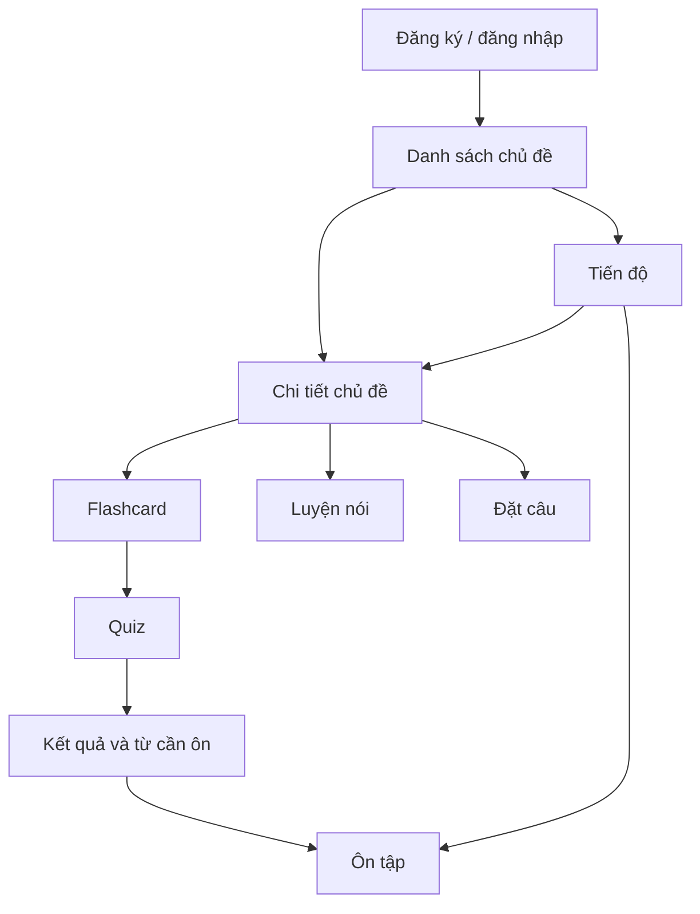
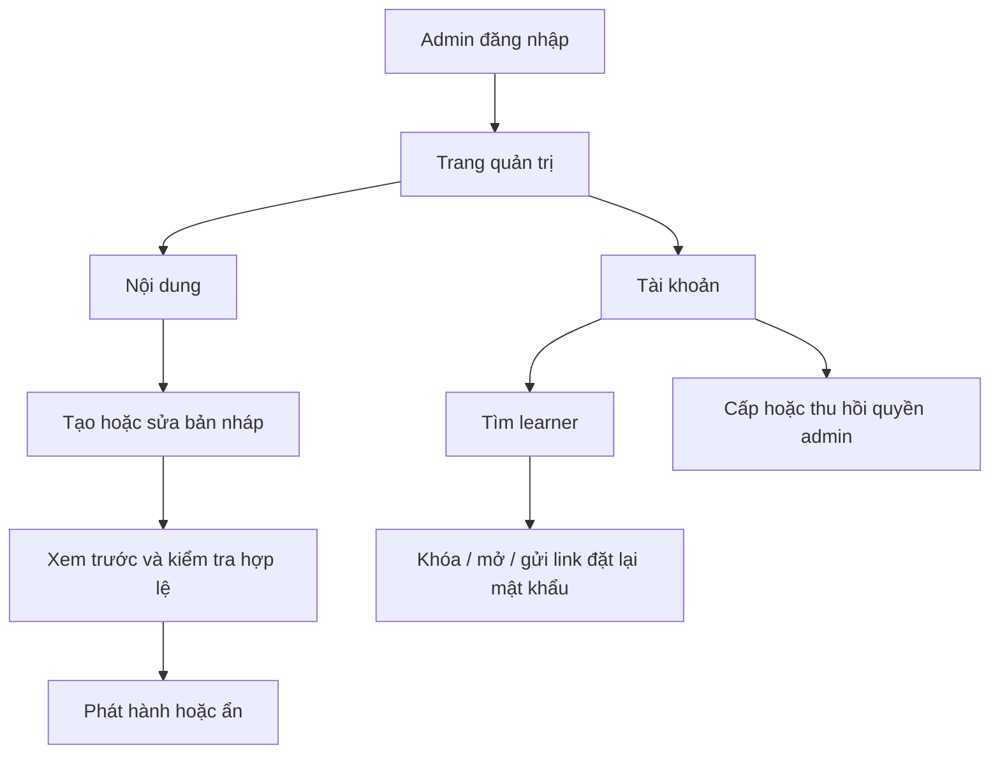

# 02. Người dùng và luồng học

## Người dùng mục tiêu

**Người mới học (A0–A1), 15 tuổi trở lên:** có thể đọc giao diện tiếng Việt, muốn học 10–15 phút/lần, dùng điện thoại Android hoặc trình duyệt máy tính. Cần từ thông dụng, ví dụ ngắn, phát âm dễ nghe và tiến độ rõ.

**Admin (quản trị viên/nhóm chuyên môn):** một role chung cho người soạn, rà soát, phát hành chủ đề và quản lý tài khoản. Admin dùng giao diện web; dữ liệu ban đầu có thể import/seed rồi sửa, xem trước và phát hành trên web. Quyền chi tiết ở [09-access-control.md](09-access-control.md).

## Giá trị của một phiên học

1. Chọn chủ đề và xem mục tiêu, số từ, tiến độ.
2. Xem flashcard: mặt trước là từ/hình; mặt sau là IPA, nghĩa tiếng Việt, ví dụ và âm thanh. Người học đánh dấu “đã xem”; không ép phải nhớ sau một lần.
3. Làm quiz 10 câu được tạo từ bộ từ của chủ đề. Sau mỗi câu, xem đáp án và giải thích ngắn. Cuối lượt, xem điểm và các từ sai.
4. Với từ cần luyện, người học có thể ghi âm từ hoặc câu mẫu. Ứng dụng hiển thị bản chép lời STT và mức khớp. Có nút thử lại và hướng dẫn khi mic bị từ chối.
5. Viết một câu dùng từ đang học. AI trả nhận xét tối đa 3 ý: có dùng đúng từ không, lỗi cần sửa, một câu gợi ý. Người học có thể gửi lại trong hạn mức.
6. Màn tiến độ đưa từ sai/đến hạn vào hàng ôn. Người học có thể rời ứng dụng sau quiz và trở lại sau.

## Sơ đồ màn hình MVP

## Luồng admin trên web

Sau đăng nhập, ứng dụng điều hướng theo role hiện thời. Learner không thấy màn quản trị; admin không làm bài học bằng tài khoản quản trị. Nếu tài khoản bị khóa hoặc role bị thay đổi khi đang mở ứng dụng, yêu cầu tiếp theo bị máy chủ từ chối và UI tải lại trạng thái.

## Trạng thái cần thiết

- Lần đầu: giới thiệu ngắn, đăng ký/đăng nhập, danh sách chủ đề.
- Đang học: lưu chỉ số thẻ đã xem cục bộ cho phiên; khi hoàn thành quiz mới ghi kết quả lâu dài. Nếu thoát giữa quiz, cho bắt đầu lại; không tính lượt chưa nộp.
- Mic không cấp quyền hoặc không hỗ trợ: hiện hướng dẫn và vẫn cho học, quiz, đặt câu.
- STT không nghe rõ: hiện bản chép lời nếu có; không trừ tiến độ, cho thử lại.
- AI/STT lỗi hoặc hết hạn mức: hiện thông báo cụ thể, giữ câu đã nhập và cho thử sau. Quiz/ôn tập không phụ thuộc AI.
- Mất mạng: hiển thị trạng thái kết nối; không hứa lưu kết quả chưa gửi lên máy chủ. Trước khi rời màn có thay đổi chưa đồng bộ, báo rõ.

## Nguyên tắc UX

- Một nhiệm vụ chính mỗi màn; nút tiếp theo luôn rõ.
- Văn bản tiếng Việt ngắn, hạn chế thuật ngữ. Luôn có đáp án đúng sau quiz.
- Không dùng màu làm tín hiệu duy nhất; kèm chữ và biểu tượng.
- Có phụ đề/bản viết cho âm thanh, chạm mục tiêu đủ lớn, hỗ trợ phóng to chữ và thao tác bàn phím trên web.
- Không đưa nhận xét AI dưới dạng “chấm điểm chính xác”.
