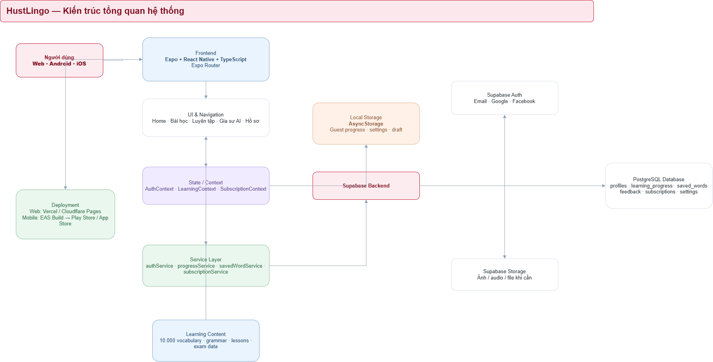

# 05. Kiến trúc và dữ liệu

## Kiến trúc theo README

Mũi tên chỉ thao tác ứng dụng gọi/đọc/ghi; đường nét đứt là build/phát hành. UI/Expo Router, AuthContext/LearningContext và Supabase client/supabaseData thuộc ứng dụng Expo. AsyncStorage và nội dung đóng gói nằm trên máy; Supabase Auth/PostgreSQL nằm trên cloud. Deploy: Expo export + EAS Deploy, EAS Build, Supabase Cloud.

Supabase client (`src/services/supabase.ts`) cấu hình kết nối và session. `supabaseData.ts` là adapter **chạy phía client** thực hiện get/update profile, get/put progress, feedback. Tutor dùng thêm `supabase.functions.invoke` để gọi Edge Function `tutor-chat`; provider secret chỉ nằm ở server. RLS/SQL grants ở DB quyết định quyền thật. SubscriptionContext và voice AI vẫn là phần mở rộng.

## Hiện trạng và mục tiêu

| Thành phần | Hiện có | Cần bổ sung |
| --- | --- | --- |
| Routes/features | Home/Profile/Auth và Tutor Home → Scenario → Chat → Summary | Lessons/Practice UI và Tutor voice/session sync nâng cao |
| Account | Supabase Auth, `profiles` chứa role/status | Chặn tự sửa role/status; guard account disabled ở DB/API |
| Tiến độ | `learning_progress.state` JSON, AsyncStorage theo user ID | Guest import, ID lượt, merge chống trùng và tránh mất update |
| Feedback | Bảng `feedback` ghi góp ý người dùng | Error/retry và validation đầu vào |
| Metadata mới | README dự kiến saved_words/subscriptions/user_settings | Chỉ migration khi có contract; saved words hiện nằm trong LearningState |
| Admin/AI | Tutor chat Edge Function contract, tutor session/message/memory migration | Deploy provider thật, STT/TTS, quota, memory extraction và P1 admin functions |

`role/status` hiện nằm trong hàng profiles có quyền owner-update cả bảng. Cần giới hạn cột hồ sơ người dùng được sửa hoặc tách bảng chỉ server ghi; không coi mã UI chỉ gửi tên hiển thị là đủ bảo vệ.

## Mô hình state và đồng bộ P0

`LearningState` hiện chứa studied/review/saved word IDs, completedLessonIds, correctAnswers/totalAnswers, minutesToday và lastStudyDate. Đây là thống kê tự luyện do client tạo; RLS chỉ bảo vệ dữ liệu của từng account, không biến điểm tự khai thành kết quả được xác minh.

Trước khi Auth chuyển danh tính, giữ snapshot guest. Đề xuất bổ sung `importId`, `attemptId/eventId` và phiên bản state. Nhập guest qua thao tác `merge_progress`/RPC có transaction: lấy account từ JWT, kiểm status, union các ID và chống lặp import/lượt; tổng câu đúng/sai được tính lại từ lượt unique. Không chỉ cộng counters hoặc lấy max rồi gọi đó là hợp nhất mọi lượt. App giữ bản local cho đến khi cloud xác nhận; không tự nhập snapshot đã dùng vào account khác.

Sync nhiều thiết bị phải hợp nhất trên server thay vì ghi đè snapshot từ hai máy. `supabaseData.putProgress` hiện chỉ upsert; cần thay contract khi triển khai merge. Thông báo rõ đang lưu/lỗi/đã đồng bộ.

## Hợp đồng thao tác

| Nhóm | Hiện có / mục tiêu | Dữ liệu và giới hạn |
| --- | --- | --- |
| Profile | `getProfile`, `updateProfile` hiện có | Chỉ account mình; whitelist các cột an toàn, không nhận role/status tùy ý |
| Progress | `getProgress`, `putProgress` hiện có → `merge_progress` dự kiến P0 | State có version, import/lượt unique; server dùng JWT, transaction, status active |
| Feedback | `sendFeedback` hiện có | Góp ý người dùng; khác với phản hồi AI do server tạo |
| Review local | Provider câu hỏi tại Practice | Chọn từ due, trả prompt/options/đáp án tự luyện rồi mới nhận lựa chọn; lưu lượt unique và due date |
| Admin | `admin_content`, `admin_users` dự kiến P1 | JWT admin active, kiểm dữ liệu, publish version, reset link, đổi role/status và audit |
| AI | STT/LLM/TTS adapters dự kiến | Keys/hạn mức ở Edge Functions; không nhận cờ premium hoặc user ID do client tự khai |

## Chế độ kết quả server trong giai đoạn mở rộng

Nếu nhóm bổ sung bài kiểm tra được máy chủ xác nhận, dùng bảng `quiz_sessions/attempts/answers`, `review_sessions/items/attempts` chỉ server ghi. `start_quiz(topic_id)` cấp session và câu không có đáp án; `submit_quiz(session_id, selections)` kiểm sở hữu/hạn/câu và chấm một lần. `start_review(word_id?)` cấp review session, prompt/options không đáp án; `submit_review(review_session_id, selected_option_id)` chấm đúng phiên một lần và cập nhật lịch trong transaction. Không có luồng submit mà client chưa được cấp câu hỏi.

Ngân hàng server tách khỏi câu tự luyện có đáp án trong bundle. Client chỉ đọc kết quả của mình; không có grants ghi trên bảng kết quả/hạn mức/AI feedback/audit. Edge Functions TypeScript/Deno hoặc RPC tin cậy tra role/status hiện thời; service key ở server. Đây là thiết kế mở rộng, chưa phải code đã triển khai hoặc điều kiện cho mọi bài guest.

## Bản nháp và tài sản P1

Admin quản lý topic/lesson/content_revision và question bank riêng; publish tạo version, ghi reviewer/publisher/time. Learner/guest chỉ đọc dữ liệu đã công bố; giữ snapshot cho lượt đang diễn ra. Storage ảnh/audio thêm khi có nhu cầu upload; không đưa draft/asset private vào bundle công khai.
