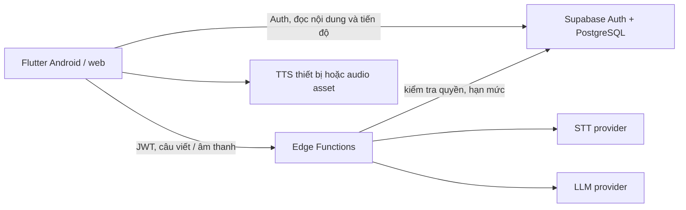

# 05. Kiến trúc và dữ liệu

## Lựa chọn kỹ thuật đề xuất

| Lớp | Lựa chọn | Vai trò |
| --- | --- | --- |
| Ứng dụng | Flutter/Dart | Một mã nguồn giao diện cho Android và web; cấu trúc responsive |
| Xác thực và dữ liệu | Supabase Auth + PostgreSQL | Tài khoản, nội dung, kết quả, lịch ôn; Row Level Security (RLS) |
| Logic máy chủ | Supabase Edge Functions | Kiểm tra dữ liệu, hạn mức, gọi STT/AI; giữ bí mật khóa dịch vụ |
| Âm thanh | TTS hệ điều hành/trình duyệt hoặc file có quyền sử dụng; plugin ghi âm tương thích Android/web | Nghe mẫu và ghi âm ngắn |
| AI/STT | Nhà cung cấp qua adapter máy chủ | Có thể thay dịch vụ, mock trong phát triển và kiểm thử |

Nhóm cần làm một **spike tuần 1**: ghi âm trên Android/web, quyền mic, gửi mẫu đến STT, đo độ trễ/chi phí; đồng thời thử TTS. Nếu plugin không đạt trên web, thay bằng cơ chế ghi âm web riêng sau khi đánh giá thời gian. Không gắn toàn bộ UI vào API của một nhà cung cấp.

## Mô hình dữ liệu tối thiểu

| Bảng | Trường chính | Ghi chú |
| --- | --- | --- |
| `topics` | `id`, `title_vi`, `description_vi`, `sort_order`, `content_version`, `published` | Chỉ chủ đề đã duyệt mới hiện cho người học |
| `profiles` | `user_id`, `display_name`, `created_at` | Hồ sơ hiển thị gắn với Supabase Auth |
| `vocabulary` | `id`, `topic_id`, `word`, `ipa`, `part_of_speech`, `meaning_vi`, `example_en`, `example_vi`, `accepted_speech`, `image_asset`, `audio_asset`, `sort_order`, `content_version` | `topic_id` khóa ngoại; ID từ giữ ổn định |
| `quiz_items` | `id`, `topic_id`, `vocabulary_id`, `type`, `prompt`, `options_json`, `correct_option_id`, `explanation_vi`, `content_version` | Chỉ máy chủ/luật quiz được quyền xác nhận đáp án; client có thể hiển thị đáp án sau nộp |
| `quiz_sessions` | `id`, `user_id`, `topic_id`, `quiz_item_ids`, `content_version`, `expires_at`, `submitted_at` | Giữ bộ 10 câu đã cấp; chỉ nộp một lần; dọn phiên hết hạn |
| `quiz_attempts` | `id`, `user_id`, `topic_id`, `content_version`, `score`, `submitted_at` | Mỗi lượt nộp là một bản ghi |
| `quiz_answers` | `attempt_id`, `quiz_item_id`, `selected_option_id`, `is_correct` | Phục vụ từ cần ôn và kiểm tra điểm |
| `review_items` | `user_id`, `vocabulary_id`, `stage`, `due_at`, `last_result_at` | Khóa duy nhất `(user_id, vocabulary_id)`; `stage` 0–2 |
| `review_attempts` | `id`, `user_id`, `vocabulary_id`, `quiz_item_id`, `selected_option_id`, `is_correct`, `submitted_at` | Lưu lượt ôn để tránh bấm lại tăng giai đoạn |
| `writing_feedback` | `id`, `user_id`, `vocabulary_id`, `sentence`, `feedback_json`, `created_at` | Chỉ lưu phản hồi hợp lệ; phục vụ giới hạn 5 lượt/ngày |
| `speech_attempts` | `id`, `user_id`, `vocabulary_id`, `reference_text`, `transcript`, `match_status`, `created_at` | Không lưu file âm thanh gốc; có thể chỉ giữ kết quả gần nhất nếu muốn giảm dữ liệu |

`user_id` lấy từ JWT đã xác thực, không tin giá trị do client gửi. Bật RLS cho mọi bảng dữ liệu cá nhân; chính sách chỉ cho chủ sở hữu đọc/ghi. Người học chỉ đọc `topics`/`vocabulary` đã xuất bản; `quiz_items` gồm đáp án đúng chỉ được đọc bởi logic máy chủ. Quyền ghi nội dung dành cho tài khoản quản trị/seed script, không nằm trong ứng dụng người học.

## Hợp đồng chức năng máy chủ

Các tên dưới đây là hợp đồng logic cho Edge Functions; URI thực tế có thể theo quy ước của Supabase. Mọi yêu cầu cần JWT, trừ nội dung công khai nếu nhóm chọn đọc công khai.

| Thao tác | Đầu vào | Đầu ra/lỗi chính |
| --- | --- | --- |
| `start_quiz` | `topic_id` | `session_id`, `content_version`, 10 câu không kèm đáp án; lỗi 409 nếu nội dung chưa đủ câu hợp lệ |
| `submit_quiz` | `session_id`, danh sách `{quiz_item_id, selected_option_id}` | `attempt_id`, `score`, đáp án/giải thích, từ cần ôn; lỗi 400 nếu thiếu/trùng câu, 409 nếu phiên bản cũ hoặc đã nộp |
| `submit_review` | `vocabulary_id`, `quiz_item_id`, `selected_option_id` cho một từ đến hạn | `is_correct`, đáp án/giải thích, `next_due_at`; chỉ chấp nhận câu thuộc từ và ngăn gửi lặp cùng lượt |
| `evaluate_speech` | `vocabulary_id`, `mode` (`word` hoặc `example`), file audio tối đa 10 giây (giới hạn kích thước cấu hình) | `transcript`, `match_status`, `message_vi`; lỗi 400 file sai, 429 hạn mức, 503 STT lỗi |
| `feedback_sentence` | `vocabulary_id`, `sentence` 5–200 ký tự | `uses_word`, `strength`, `corrections[]` tối đa 2, `suggested_sentence`; lỗi 400/429/503 |
| `delete_account` | xác nhận từ người dùng đã đăng nhập | Xóa dữ liệu phụ thuộc và tài khoản hoặc mã yêu cầu xóa thủ công có trạng thái theo dõi |

`submit_quiz` phải tính điểm phía máy chủ từ `quiz_items`; không tin điểm client. Sau khi nộp, cập nhật `review_items` trong cùng giao dịch để tránh điểm và lịch ôn lệch nhau. `start_quiz` trả 10 câu không kèm đáp án đúng; `submit_quiz` chỉ chấp nhận đúng bộ câu của phiên và chỉ nộp một lần. Không đặt đáp án đúng trong bundle ứng dụng.

## Quy trình nói và viết

**Nói:** người dùng cấp quyền mic → ghi tối đa 10 giây → client kiểm tra định dạng/kích thước → gửi qua HTTPS → máy chủ kiểm tra JWT/hạn mức → gọi STT → chuẩn hóa bản chép lời và đáp án chấp nhận → trả trạng thái. Không lưu audio vào log hoặc bucket thường trực. Nếu phải lưu tạm vì API nhà cung cấp, xóa sau xử lý và đặt thời hạn dọn rác ngắn.

**Viết:** client gửi câu → máy chủ kiểm tra độ dài, quyền và hạn mức → gọi LLM với nội dung học được kiểm duyệt → yêu cầu JSON theo schema → kiểm tra cấu trúc/độ dài phản hồi → lưu và trả. Nội dung người học được coi là dữ liệu, không phải chỉ thị hệ thống. Lỗi mô hình hoặc phản hồi sai schema trả 503, giữ câu trong UI và không tính lượt thành công.

## Bảo mật, quyền riêng tư và vận hành

- Không đưa khóa STT/LLM vào ứng dụng hoặc kho mã. Dùng biến môi trường phía máy chủ; có môi trường phát triển và demo riêng.
- Đặt hạn mức theo tài khoản và giới hạn kích thước audio/câu để tránh chi phí tăng bất ngờ. Log mã lỗi, thời gian, số lượt; tránh log câu và bản ghi âm nguyên văn.
- Nêu rõ cho người dùng rằng câu viết và âm thanh được gửi đến dịch vụ xử lý bên ngoài, mục đích sử dụng và cách xóa dữ liệu. Không dùng dữ liệu thật của người học trong tài khoản demo công khai.
- Sao lưu dữ liệu theo khả năng dịch vụ; trước demo xuất dữ liệu nội dung và chuẩn bị seed script. Có mock AI/STT để demo luồng khi nhà cung cấp tạm ngừng, nhưng phải ghi rõ đây là chế độ mô phỏng.
- Kiểm tra điều khoản sử dụng và khả năng xử lý dữ liệu của nhà cung cấp trước khi chốt tích hợp. Đây là quyết định tuần 1–2, không khóa nhà cung cấp trong tài liệu này.
