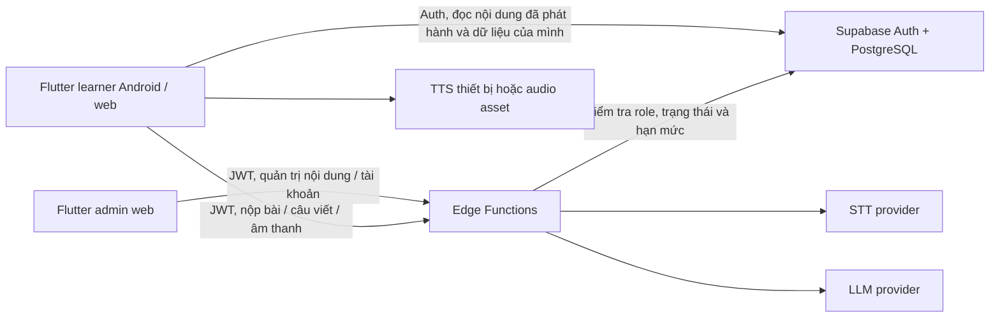

# 05. Kiến trúc và dữ liệu

## Lựa chọn kỹ thuật đề xuất

| Lớp | Lựa chọn | Vai trò |
| --- | --- | --- |
| Ứng dụng | Flutter/Dart + Material 3; `go_router`, `flutter_riverpod` | Một mã nguồn giao diện cho Android/web; route và state theo feature, giao diện responsive |
| Xác thực và dữ liệu | Supabase Auth + PostgreSQL | Tài khoản, nội dung, kết quả, lịch ôn; Row Level Security (RLS) |
| Logic máy chủ | Supabase Edge Functions bằng TypeScript/Deno | Kiểm tra role/trạng thái, chấm điểm, quản lý nội dung/tài khoản, hạn mức, gọi STT/AI; giữ bí mật khóa dịch vụ |
| Âm thanh | `record`, `flutter_tts`, file audio có quyền sử dụng khi cần | Nghe mẫu và ghi âm ngắn; thử quyền/codec trên Android và web ở tuần 1 |
| AI/STT | Nhà cung cấp qua adapter máy chủ | Có thể thay dịch vụ, mock trong phát triển và kiểm thử |

Nhóm cần làm một **spike tuần 1**: ghi âm trên Android/web, quyền mic, gửi mẫu đến STT, đo độ trễ/chi phí; đồng thời thử TTS. Nếu plugin không đạt trên web, thay bằng cơ chế ghi âm web riêng sau khi đánh giá thời gian. Không gắn toàn bộ UI vào API của một nhà cung cấp.

Danh sách ngôn ngữ, package, cấu trúc thư mục, môi trường và lệnh triển khai được chốt tại [10-implementation-stack.md](10-implementation-stack.md). [Prototype](../prototype/README.md) là bản xem luồng giao diện bằng web thuần với dữ liệu giả; không thay thế ứng dụng Flutter hoặc các kiểm tra quyền phía Supabase.

## Mô hình dữ liệu tối thiểu

| Bảng | Trường chính | Ghi chú |
| --- | --- | --- |
| `topics` | `id`, `sort_order`, `published_version`, `hidden` | Chủ đề ổn định; learner chỉ thấy phiên bản đã phát hành và chưa ẩn |
| `topic_revisions` | `topic_id`, `content_version`, `title_vi`, `description_vi`, `lesson_blocks_json`, `status`, `reviewed_by`, `published_by`, `published_at` | Bản nháp hoặc bản đã phát hành; bài giảng ngắn nằm trong phiên bản nội dung |
| `profiles` | `user_id`, `display_name`, `account_status`, `created_at` | `active`/`disabled`; người dùng chỉ tự sửa `display_name` |
| `user_roles` | `user_id`, `role`, `updated_at` | Chỉ `admin`/`learner`; chỉ máy chủ ghi; không đặt role trong metadata client tự sửa |
| `vocabulary` | `id`, `topic_id`, `word`, `ipa`, `part_of_speech`, `meaning_vi`, `example_en`, `example_vi`, `accepted_speech`, `image_asset`, `audio_asset`, `sort_order`, `content_version` | `topic_id` khóa ngoại; ID từ giữ ổn định |
| `quiz_items` | `id`, `topic_id`, `vocabulary_id`, `type`, `prompt`, `image_asset`, `image_alt_vi`, `fallback_prompt_vi`, `options_json`, `correct_option_id`, `explanation_vi`, `content_version` | Với `type = image_to_word`, ba trường ảnh/mô tả/câu thay thế là bắt buộc; đáp án đúng chỉ máy chủ đọc |
| `quiz_sessions` | `id`, `user_id`, `topic_id`, `quiz_item_ids`, `content_version`, `expires_at`, `submitted_at` | Giữ bộ 10 câu đã cấp; chỉ nộp một lần; dọn phiên hết hạn |
| `quiz_attempts` | `id`, `user_id`, `topic_id`, `content_version`, `score`, `submitted_at` | Mỗi lượt nộp là một bản ghi |
| `quiz_answers` | `attempt_id`, `quiz_item_id`, `selected_option_id`, `is_correct` | Phục vụ từ cần ôn và kiểm tra điểm |
| `review_items` | `user_id`, `vocabulary_id`, `stage`, `due_at`, `last_result_at` | Khóa duy nhất `(user_id, vocabulary_id)`; `stage` 0–2 |
| `review_sessions` | `id`, `user_id`, `vocabulary_id`, `quiz_item_id`, `expires_at`, `submitted_at` | Cấp một câu hỏi ôn không kèm đáp án; chỉ nộp một lần |
| `review_attempts` | `id`, `user_id`, `vocabulary_id`, `quiz_item_id`, `selected_option_id`, `is_correct`, `submitted_at` | Lưu lượt ôn để tránh bấm lại tăng giai đoạn |
| `writing_feedback` | `id`, `user_id`, `vocabulary_id`, `sentence`, `feedback_json`, `created_at` | Chỉ lưu phản hồi hợp lệ; phục vụ giới hạn 5 lượt/ngày |
| `speech_attempts` | `id`, `user_id`, `vocabulary_id`, `reference_text`, `transcript`, `match_status`, `created_at` | Không lưu file âm thanh gốc; có thể chỉ giữ kết quả gần nhất nếu muốn giảm dữ liệu |
| `admin_audit_log` | `id`, `actor_user_id`, `target_type`, `target_id`, `action`, `created_at` | Ghi phát hành/ẩn nội dung, khóa/mở tài khoản, đổi role; client không sửa/xóa |

`user_id` lấy từ JWT đã xác thực, không tin giá trị do client gửi. Khi Auth tạo tài khoản, trigger phía máy chủ tạo `profiles` ở trạng thái `active` và `user_roles = learner`; nếu tạo hồ sơ/role thất bại, phải xử lý lỗi đăng ký thay vì để tài khoản thiếu role. Bảng `vocabulary` và `quiz_items` gắn với `(topic_id, content_version)`; khóa bản ghi gồm ID và phiên bản để giữ snapshot cũ cho phiên quiz còn hạn. Bật RLS và quyền cột/bảng theo ma trận ở [09-access-control.md](09-access-control.md): learner chỉ đọc nội dung đã phát hành/chưa ẩn và dữ liệu học của mình; `quiz_items` có đáp án đúng chỉ máy chủ đọc. Learner sửa riêng `profiles.display_name` qua `update_profile`, không được sửa `account_status` hay `user_roles`. Admin xem bản nháp và danh sách tài khoản qua Edge Functions, không dùng quyền ghi DB trực tiếp từ client.

**Chỉ Edge Functions được ghi** `quiz_sessions`, `quiz_attempts`, `quiz_answers`, `review_sessions`, `review_items`, `review_attempts`, `writing_feedback`, `speech_attempts`, `user_roles`, trạng thái tài khoản, nội dung và `admin_audit_log`. Không tạo RLS `INSERT/UPDATE/DELETE` cho client trên các bảng này; thu hồi quyền ghi của vai trò `authenticated` ở tầng SQL. Function xác thực JWT, tra role và `account_status` hiện thời bằng truy vấn tin cậy, rồi dùng service key phía máy chủ cho thao tác cần đặc quyền. Không chỉ dựa vào claim role trong token vì có thể còn hiệu lực sau khi đổi role/khóa tài khoản. RLS đọc của learner cũng yêu cầu trạng thái `active`; đường API trực tiếp không được vượt qua khóa tài khoản.

## Hợp đồng chức năng máy chủ

Các tên dưới đây là hợp đồng logic cho Edge Functions; URI thực tế có thể theo quy ước của Supabase. Mọi yêu cầu cần JWT, trừ nội dung công khai nếu nhóm chọn đọc công khai.

| Thao tác | Đầu vào | Đầu ra/lỗi chính |
| --- | --- | --- |
| `start_quiz` | `topic_id` | `session_id`, `content_version`, 10 câu không kèm đáp án; lỗi 409 nếu nội dung chưa đủ câu hợp lệ |
| `submit_quiz` | `session_id`, danh sách `{quiz_item_id, selected_option_id}` | `attempt_id`, `score`, đáp án/giải thích, từ cần ôn; lỗi 400 nếu thiếu/trùng câu, 409 nếu phiên bản cũ hoặc đã nộp |
| `start_review` | không có hoặc `vocabulary_id` trong hàng ôn đến hạn | `review_session_id`, một câu hỏi/ba phương án không kèm đáp án; lỗi 404 nếu không có từ đến hạn |
| `submit_review` | `review_session_id`, `selected_option_id` | `is_correct`, đáp án/giải thích, `next_due_at`; chỉ chấp nhận câu đã cấp và ngăn gửi lặp |
| `evaluate_speech` | `vocabulary_id`, `mode` (`word` hoặc `example`), file audio tối đa 10 giây (giới hạn kích thước cấu hình) | `transcript`, `match_status`, `message_vi`; lỗi 400 file sai, 429 hạn mức, 503 STT lỗi |
| `feedback_sentence` | `vocabulary_id`, `sentence` 5–200 ký tự | `uses_word`, `strength`, `corrections[]` tối đa 2, `suggested_sentence`; lỗi 400/429/503 |
| `update_profile` | `display_name` đã giới hạn độ dài | Hồ sơ của chính người gọi; không nhận `role`, `account_status` hoặc `user_id` từ client |
| `delete_account` | xác nhận từ người dùng đã đăng nhập | Xóa dữ liệu phụ thuộc và tài khoản hoặc mã yêu cầu xóa thủ công có trạng thái theo dõi |
| `admin_content` | hành động `list`, `create_draft`, `update_draft`, `preview`, `publish`, `hide` và dữ liệu phù hợp | Danh sách/bản nháp/phiên bản đã phát hành; lỗi 403 nếu không phải admin, 400 nếu nội dung chưa hợp lệ |
| `admin_users` | hành động `list`, `set_status`, `send_reset_link`, `set_role` và tài khoản đích | Danh sách/tình trạng thao tác; lỗi 403 nếu không phải admin, 409 nếu hạ quyền admin cuối cùng |

`submit_quiz` phải tính điểm phía máy chủ từ `quiz_items`; không tin điểm client. Sau khi nộp, cập nhật `review_items` trong cùng giao dịch để tránh điểm và lịch ôn lệch nhau. `start_quiz` trả 10 câu không kèm đáp án đúng; `submit_quiz` chỉ chấp nhận đúng bộ câu của phiên và chỉ nộp một lần. Không đặt đáp án đúng trong bundle ứng dụng.

Với `image_to_word`, `start_quiz` ưu tiên chọn ít nhất một câu hình khi chủ đề có câu hợp lệ, trả đường dẫn ảnh có quyền đọc cho learner, `image_alt_vi` và `fallback_prompt_vi`, nhưng không trả `correct_option_id`. Client hiển thị câu chữ thay thế nếu tải ảnh lỗi; trình đọc màn hình dùng mô tả tiếng Việt. Admin chỉ phát hành nếu ảnh và câu chữ thay thế hợp lệ, cùng trỏ tới một đáp án.

`start_review` chọn từ đến hạn của người học, cấp một câu hỏi không lộ đáp án và lưu `review_sessions`. `submit_review` kiểm tra phiên, quyền sở hữu, hạn dùng và lựa chọn trước khi chấm/cập nhật lịch ôn trong cùng giao dịch. Các function learner đều yêu cầu role `learner` và trạng thái `active`; function admin yêu cầu role `admin` và trạng thái `active`.

`admin_content` chỉ sửa bản `draft`; khi phát hành phải kiểm tra bài giảng, 20–30 từ, tối thiểu 40 câu hỏi hợp lệ và tài sản, rồi tăng phiên bản và ghi audit. `admin_users` thao tác với Auth bằng service key ở máy chủ, không chuyển email/mật khẩu hoặc danh sách tài khoản qua bảng công khai. `set_role` và `set_status` kiểm tra lại role của người gọi trong DB ngay trước khi ghi, khóa giao dịch để không thể đồng thời hạ hai admin cuối cùng, và ghi audit. Tài khoản `disabled` có thể vẫn có phiên Auth ở phía client, nhưng RLS và Edge Functions không cho truy cập dữ liệu/chức năng; UI yêu cầu đăng xuất.

## Quy trình nói và viết

**Nói:** người dùng cấp quyền mic → ghi tối đa 10 giây → client kiểm tra định dạng/kích thước → gửi qua HTTPS → máy chủ kiểm tra JWT/hạn mức → gọi STT → chuẩn hóa bản chép lời và đáp án chấp nhận → trả trạng thái. Không lưu audio vào log hoặc bucket thường trực. Nếu phải lưu tạm vì API nhà cung cấp, xóa sau xử lý và đặt thời hạn dọn rác ngắn.

**Viết:** client gửi câu → máy chủ kiểm tra độ dài, quyền và hạn mức → gọi LLM với nội dung học được kiểm duyệt → yêu cầu JSON theo schema → kiểm tra cấu trúc/độ dài phản hồi → lưu và trả. Nội dung người học được coi là dữ liệu, không phải chỉ thị hệ thống. Lỗi mô hình hoặc phản hồi sai schema trả 503, giữ câu trong UI và không tính lượt thành công.

## Bảo mật, quyền riêng tư và vận hành

- Không đưa khóa STT/LLM vào ứng dụng hoặc kho mã. Dùng biến môi trường phía máy chủ; có môi trường phát triển và demo riêng.
- Đặt hạn mức theo tài khoản và giới hạn kích thước audio/câu để tránh chi phí tăng bất ngờ. Log mã lỗi, thời gian, số lượt; tránh log câu và bản ghi âm nguyên văn.
- Nêu rõ cho người dùng rằng câu viết và âm thanh được gửi đến dịch vụ xử lý bên ngoài, mục đích sử dụng và cách xóa dữ liệu. Không dùng dữ liệu thật của người học trong tài khoản demo công khai.
- Sao lưu dữ liệu theo khả năng dịch vụ; trước demo xuất dữ liệu nội dung và chuẩn bị seed script. Có mock AI/STT để demo luồng khi nhà cung cấp tạm ngừng, nhưng phải ghi rõ đây là chế độ mô phỏng.
- Kiểm tra điều khoản sử dụng và khả năng xử lý dữ liệu của nhà cung cấp trước khi chốt tích hợp. Đây là quyết định tuần 1–2, không khóa nhà cung cấp trong tài liệu này.
