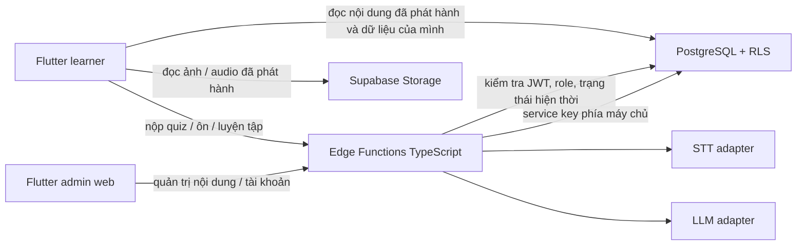

# 10. Công nghệ và cấu trúc triển khai

Tài liệu này chốt **stack đề xuất cho sản phẩm MVP**, không thay đổi kiến trúc trong [05-architecture.md](05-architecture.md). Thời điểm tạo tài liệu, repo mới có tài liệu và [clickable prototype](../prototype/README.md); chưa có project Flutter hoặc Supabase thật. Nhóm cần xác nhận phiên bản tương thích tại tuần 1, commit `pubspec.lock` và migration SQL để mọi máy dùng cùng bộ phụ thuộc.

## Ngôn ngữ, framework và thành phần

| Phần | Lựa chọn | Trách nhiệm |
| --- | --- | --- |
| Ứng dụng người học Android + web; admin web | **Flutter (Dart)**, Material 3 | Giao diện responsive và khả năng tiếp cận; một codebase Flutter, route theo role |
| Điều hướng | `go_router` | Route `/learner/...`, `/admin/...`, chặn màn theo role ở UI; máy chủ vẫn tự kiểm quyền |
| State và phụ thuộc | `flutter_riverpod` | Session, role, chủ đề, phiên quiz/ôn, trạng thái tải/lỗi; tách UI khỏi repository |
| Kết nối Supabase | `supabase_flutter` | Auth, đọc dữ liệu được RLS cho phép, gọi Edge Functions, lấy ảnh/âm thanh đã phát hành |
| Ghi âm và TTS | `record`, `flutter_tts` | Thu âm tối đa 10 giây và đọc mẫu; kiểm thử codec/quyền mic trên Android/web ở tuần 1 |
| Chọn ảnh của admin | `file_picker` | Chọn tài sản trước khi upload/kiểm tra; bản nháp không công khai |
| Xác thực | Supabase Auth | Email/mật khẩu, session, liên kết đặt lại mật khẩu; bootstrap admin phía máy chủ |
| Cơ sở dữ liệu | Supabase PostgreSQL + **SQL migrations** | Nội dung phiên bản, hồ sơ, role, quiz, ôn, giới hạn, audit; RLS và quyền SQL |
| File nội dung | Supabase Storage | Ảnh quiz/flashcard và audio có quyền sử dụng; bucket/path theo trạng thái bản nháp/đã phát hành |
| API nghiệp vụ | Supabase Edge Functions bằng **TypeScript trên Deno runtime** | Chấm quiz/ôn, AI/STT, kiểm tra role, quản trị nội dung và tài khoản; service key chỉ ở đây |
| AI/STT | Adapter trong Edge Functions, nhà cung cấp chốt sau spike | STT → bản chép lời; LLM → phản hồi câu có schema; mock dùng cho phát triển |
| Kiểm thử | `flutter_test`, `integration_test`, test TypeScript/Deno, SQL/RLS integration | Widget/logic, luồng Android/web, chức năng máy chủ, quyền truy cập trực tiếp |

`go_router`, `flutter_riverpod`, `record`, `flutter_tts` và `file_picker` là lựa chọn triển khai; chỉ thêm vào `pubspec.yaml` sau khi kiểm tra bản ổn định và tương thích với Flutter SDK của nhóm. Flutter/Dart và Supabase là quyết định kiến trúc; nhà cung cấp AI/STT và hosting web chưa khóa.

## Cấu trúc repo khi bắt đầu lập trình

```text
HustLingo/
├─ app/                         # Flutter project (Android + web)
│  ├─ lib/
│  │  ├─ app/                    # MaterialApp, theme, go_router, role redirect
│  │  ├─ core/                   # lỗi, cấu hình, widget dùng chung, tiện ích
│  │  ├─ features/
│  │  │  ├─ auth/                # đăng nhập, session, hồ sơ
│  │  │  ├─ learning/            # chủ đề, bài giảng, flashcard
│  │  │  ├─ quiz/                # start/submit, kết quả, câu hỏi ảnh
│  │  │  ├─ review/              # hàng ôn và lượt ôn
│  │  │  ├─ practice/            # ghi âm/STT, đặt câu/AI
│  │  │  └─ admin/               # nội dung, tài khoản
│  │  └─ data/                   # model, repository, Supabase adapters
│  ├─ test/                      # unit + widget tests
│  └─ integration_test/          # smoke tests
├─ supabase/
│  ├─ migrations/                # schema, RLS, grants, trigger, seed metadata
│  ├─ functions/                 # TypeScript Edge Functions
│  │  └─ _shared/                # auth/role guard, schema, STT/LLM adapters
│  └─ seed.sql                   # dữ liệu giả/làm mẫu, không có bí mật
├─ content/                     # JSON/CSV nguồn 4 chủ đề + checklist kiểm duyệt
├─ prototype/                   # chỉ là bản xem luồng giao diện bằng web thuần
└─ docs/
```

Mỗi feature Flutter nên có `presentation` (screen/widget), `application` (controller/provider) và `data` (repository/model) khi logic đủ lớn. UI không gọi trực tiếp bảng nhạy cảm hoặc tự tính kết quả có giá trị lưu bền. Flutter chỉ dùng `Supabase` publishable key; JWT do Auth cung cấp. Phản hồi mạng có trạng thái loading, lỗi và thử lại.

## Ranh giới truy cập



- Flutter gọi trực tiếp Auth; chỉ đọc các view/bảng được RLS cho phép. Kết quả quiz, lịch ôn, phản hồi AI/STT, role và trạng thái tài khoản **chỉ** ghi qua Edge Functions sau kiểm tra. Bản nháp và đáp án đúng không trả qua Data API cho learner.
- Edge Functions lấy `user_id` từ JWT, tra `user_roles` và `profiles.account_status` hiện thời ở mỗi yêu cầu. Không tin role do client gửi hoặc claim cũ sau khi role thay đổi.
- Ảnh đã phát hành có URL truy cập được theo chính sách Storage; ảnh bản nháp ở vùng riêng. Không đưa ảnh quiz có tên file tiết lộ đáp án nếu có thể tránh. Với `image_to_word`, function trả ảnh, mô tả và câu thay thế, nhưng không trả đáp án đúng trước khi nộp.
- Audio người học đi qua function đến STT, không lưu lâu dài. LLM chỉ nhận câu cần phản hồi và ngữ cảnh từ vựng tối thiểu. Chỉ log mã lỗi/thời gian, không log nội dung nhạy cảm.

## Chức năng backend cần viết

| Nhóm | Functions/logic | Ghi chú triển khai |
| --- | --- | --- |
| Học | `start_quiz`, `submit_quiz`, `start_review`, `submit_review` | Tính điểm/lịch ôn trên máy chủ; transaction, idempotency và snapshot phiên bản |
| Luyện tập | `evaluate_speech`, `feedback_sentence` | 10 lượt nói và 5 lượt viết/ngày/người; giới hạn audio/câu, timeout, schema phản hồi |
| Hồ sơ | `update_profile`, `delete_account` | Chỉ chính chủ hoặc quy trình admin được phép; không nhận `user_id` tùy ý |
| Admin | `admin_content`, `admin_users` | Chỉ admin active; phát hành kiểm tra nội dung; khóa/mở, reset link, đổi role có audit |
| Database | migrations, RLS, grants, trigger tạo learner | Thử bằng JWT learner A/B/admin và đường Data API trực tiếp |
| Storage | bucket/path, policy, xác minh ảnh, dọn asset bản nháp bỏ | Không cho learner xem bản nháp; không dùng service key trong Flutter |

Hợp đồng đầu vào/đầu ra chi tiết và bảng dữ liệu nằm tại [05-architecture.md](05-architecture.md). Giao dịch cập nhật quiz/ôn nên đặt trong SQL function tin cậy hoặc transaction phía máy chủ để không có trạng thái nửa chừng.

## Biến cấu hình

| Nơi | Biến/giá trị | Quy tắc |
| --- | --- | --- |
| Flutter build | `SUPABASE_URL`, `SUPABASE_PUBLISHABLE_KEY` qua `--dart-define-from-file` | Có thể hiện trong client; quyền thật dựa trên JWT/RLS. Không commit cấu hình riêng của môi trường thật |
| Edge Functions | `SUPABASE_URL`, khóa service role/secret, `STT_API_KEY`, `LLM_API_KEY`, hạn mức/timeout | Chỉ trong secrets phía máy chủ; không log hoặc trả về client |
| Local | file cấu hình mẫu không có bí mật | Thành viên tự tạo file riêng; `.gitignore` loại tệp chứa khóa |

## Trình tự khởi tạo thực tế

1. Cài Flutter SDK stable, Android SDK/thiết bị và Chrome; chạy `flutter doctor`. Chốt Flutter/Dart version của nhóm.
2. Tại repo, chạy `flutter create --platforms=android,web app`; trong `app`, thêm gói với `flutter pub add supabase_flutter go_router flutter_riverpod record flutter_tts file_picker`. Commit `pubspec.yaml` và `pubspec.lock` sau khi chạy được cả Android/web.
3. Khởi tạo Supabase CLI và migrations; tạo project dev/demo, bảng, RLS/grants, trigger learner mặc định, Storage policies và bootstrap admin. Local stack qua `supabase start` cần Docker; có thể dùng project dev riêng nếu máy không chạy Docker.
4. Tạo theme/route và repository Flutter, nối Auth → nội dung đã phát hành → quiz/ôn → admin → STT/AI. Đổi từng màn prototype sang widget Flutter; không chép logic giả lập vào sản phẩm.
5. Chạy `flutter analyze`, `flutter test`, integration test quyền/API, `flutter run -d chrome` và Android thật. Build web bằng `flutter build web`, build Android APK bằng `flutter build apk` khi đến mốc demo.

Những lệnh trên là **hướng dẫn triển khai tiếp theo**; chưa được chạy trong repo này vì môi trường hiện tại không có Flutter/Dart SDK.

## Nguồn kỹ thuật chính thức

- [Flutter app architecture](https://docs.flutter.dev/app-architecture/guide), [Flutter web build](https://docs.flutter.dev/deployment/web), [Flutter Android build](https://docs.flutter.dev/deployment/android).
- [Supabase Flutter quickstart](https://supabase.com/docs/guides/getting-started/quickstarts/flutter), [Supabase Edge Functions](https://supabase.com/docs/guides/functions/quickstart), [Supabase Storage](https://supabase.com/docs/guides/storage/quickstart).
- Package: [go_router](https://pub.dev/packages/go_router), [flutter_riverpod](https://pub.dev/packages/flutter_riverpod), [record](https://pub.dev/packages/record), [flutter_tts](https://pub.dev/packages/flutter_tts), [file_picker](https://pub.dev/packages/file_picker).
